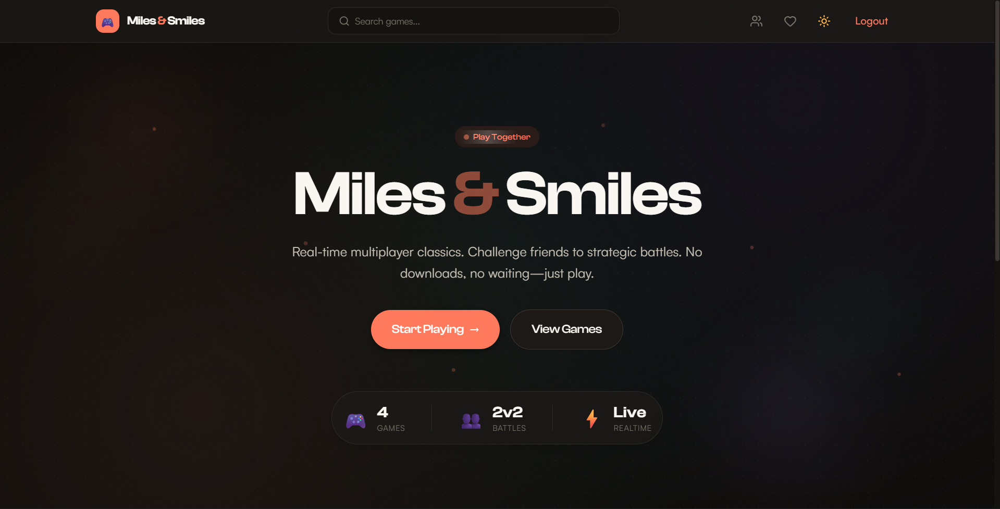
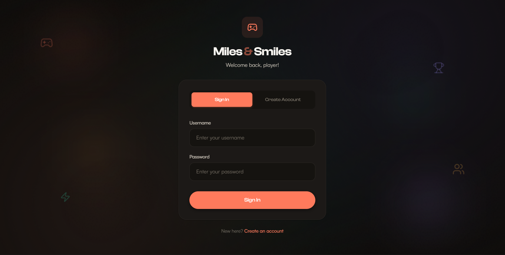
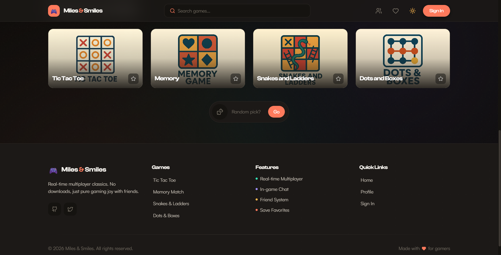
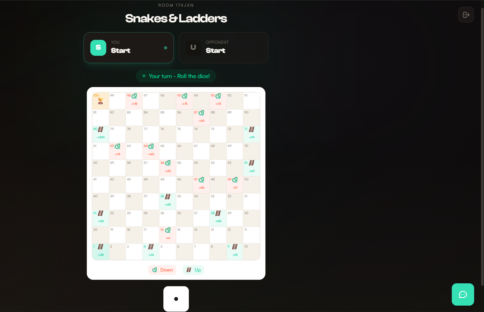
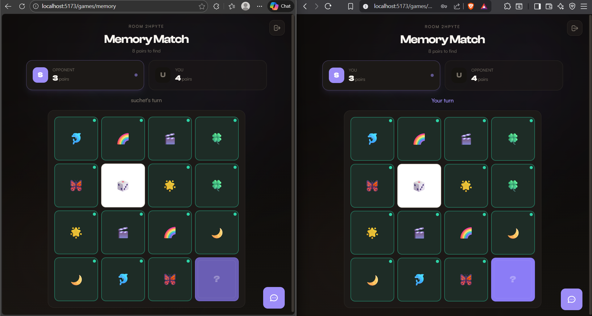
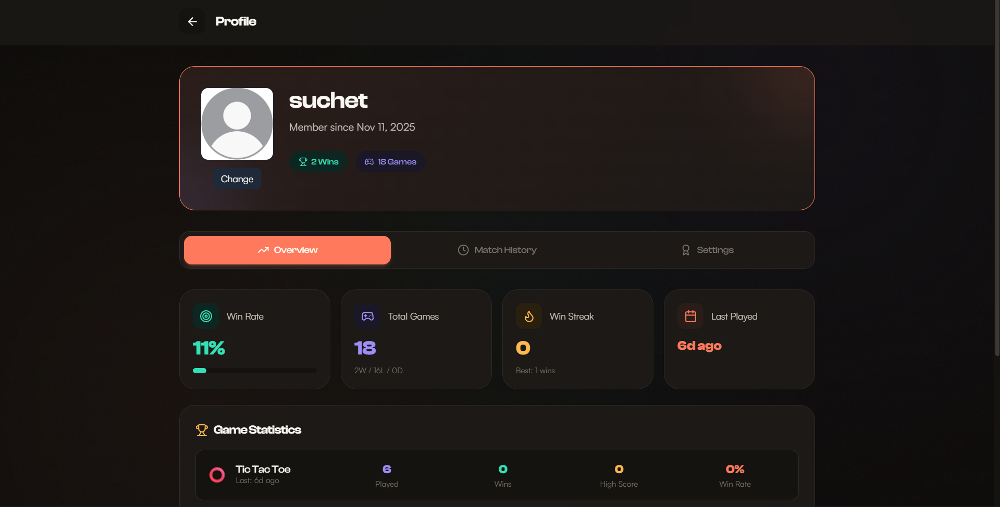
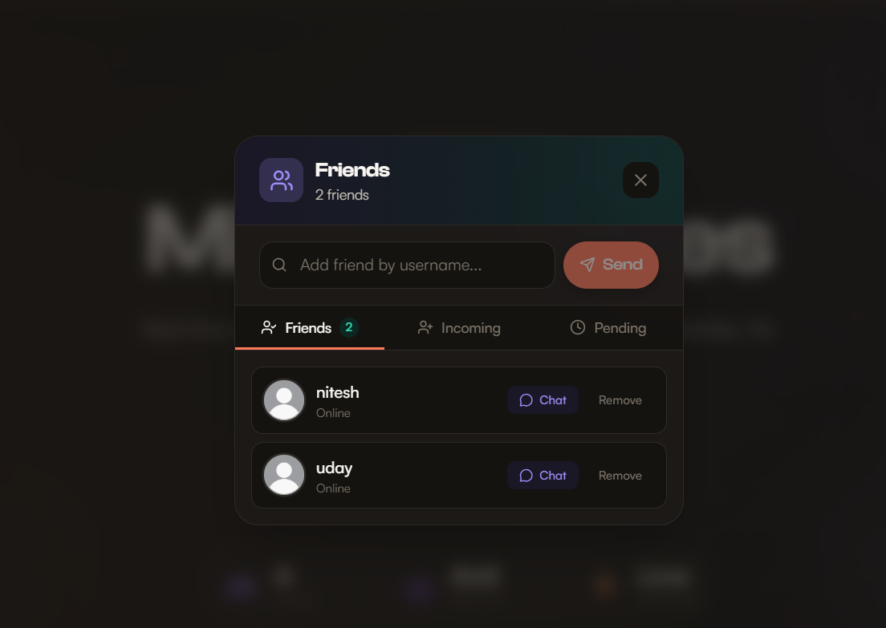

# Miles and Smiles 🎲✨

<div align="center">

**A cozy real-time multiplayer gaming platform to play casual games with friends, even from afar!**


</div>

---

## 📖 Table of Contents

- [Features](#-features)
- [Tech Stack](#-tech-stack)
- [Screenshots](#-screenshots)
- [Prerequisites](#-prerequisites)
- [Installation](#-installation)
  - [Option 1: Docker (Recommended)](#option-1-docker-recommended)
  - [Option 2: Manual Setup](#option-2-manual-setup)
- [Environment Variables](#-environment-variables)
- [Usage](#-usage)
- [Project Structure](#-project-structure)
- [API Documentation](#-api-documentation)
- [Testing](#-testing)
- [Contributing](#-contributing)
- [License](#-license)

---

## ✨ Features

| Feature | Description |
|---------|-------------|
| 🎮 **Multiple Games** | Tic-Tac-Toe, Memory Game, Dots & Boxes, Snakes & Ladders |
| ⚡ **Real-Time Gaming** | Instant game updates powered by Socket.IO |
| 🎯 **Matchmaking** | ELO-based player matching system |
| 👥 **Social System** | Add friends, chat in real-time, send notifications |
| 📈 **Progression** | Earn XP, level up, unlock achievements |
| 🤖 **AI Opponents** | Practice against computer opponents |
| 📊 **Statistics** | Track your wins, losses, ELO rating, and match history |
| 🖼️ **Profile Customization** | Upload profile pictures via Cloudinary |

---

## 🛠 Tech Stack

### Backend
- **Runtime:** Node.js with Express.js
- **Database:** MongoDB with Mongoose ODM
- **Cache:** Redis for sessions & real-time data
- **Real-Time:** Socket.IO for WebSocket connections
- **Job Queue:** Bull for background processing
- **Auth:** JWT (JSON Web Tokens)
- **Image Storage:** Cloudinary

### Frontend
- **Framework:** React 19 with Vite
- **Styling:** TailwindCSS
- **HTTP Client:** Axios
- **Real-Time:** Socket.IO Client
- **Routing:** React Router v7

### DevOps
- **Containerization:** Docker & Docker Compose
- **Reverse Proxy:** Nginx
- **Testing:** Jest (Backend) & Vitest (Frontend)

---

## 📸 Screenshots

### 🏠 Home Page


### 🔐 Login Page


### 🎮 Game Selection


### ❌⭕ Tic-Tac-Toe


### 🔲 Dots & Boxes


### 🐍🪜 Snakes & Ladders


### 🧠 Memory Game


### 👤 Profile Page


### 👥 Friends & Chat


---

## � System Architecture & Flow

## �📋 Prerequisites

Before you begin, ensure you have the following installed:

| Requirement | Version | Download Link |
|-------------|---------|---------------|
| **Node.js** | v18+ | [nodejs.org](https://nodejs.org/) |
| **npm** | v9+ | Comes with Node.js |
| **MongoDB** | v7+ | [mongodb.com](https://www.mongodb.com/try/download/community) |
| **Redis** | v7+ | [redis.io](https://redis.io/download/) |
| **Docker** (Optional) | v24+ | [docker.com](https://www.docker.com/products/docker-desktop/) |
| **Git** | Latest | [git-scm.com](https://git-scm.com/downloads) |

---

## 🚀 Installation

### Option 1: Docker (Recommended)

The easiest way to get started! Docker handles all dependencies automatically.

#### Step 1: Clone the Repository

```bash
git clone https://github.com/yourusername/miles-and-smiles.git
cd miles-and-smiles
```

#### Step 2: Create Environment File

Create a `.env` file in the root directory:

```env
# JWT Secret (generate a random string)
JWT_SECRET=your-super-secret-jwt-key-change-this

# Cloudinary (for profile pictures)
CLOUDINARY_CLOUD_NAME=your-cloud-name
CLOUDINARY_API_KEY=your-api-key
CLOUDINARY_API_SECRET=your-api-secret
```

#### Step 3: Start with Docker Compose

```bash
docker-compose up -d
```

This will start:
- 🍃 **MongoDB** on port `27017`
- 🔴 **Redis** on port `6380`
- 🖥️ **Backend API** on port `3000`
- 👷 **Background Worker** for async jobs
- 🌐 **Frontend** on port `8080`

#### Step 4: Access the Application

Open your browser and go to:
- **Frontend:** http://localhost:8080
- **Backend API:** http://localhost:3000

#### Docker Commands Cheatsheet

```bash
# Start all services
docker-compose up -d

# View logs
docker-compose logs -f

# Stop all services
docker-compose down

# Rebuild after code changes
docker-compose up -d --build

# View running containers
docker-compose ps
```

---

### Option 2: Manual Setup

For development or if you prefer not to use Docker.

#### Step 1: Clone the Repository

```bash
git clone https://github.com/yourusername/miles-and-smiles.git
cd miles-and-smiles
```

#### Step 2: Install MongoDB

**Windows:**
1. Download from [MongoDB Community Server](https://www.mongodb.com/try/download/community)
2. Run the installer and follow the wizard
3. MongoDB will run as a Windows service automatically

**macOS (Homebrew):**
```bash
brew tap mongodb/brew
brew install mongodb-community@7.0
brew services start mongodb-community@7.0
```

**Linux (Ubuntu):**
```bash
sudo apt-get install gnupg curl
curl -fsSL https://www.mongodb.org/static/pgp/server-7.0.asc | sudo gpg -o /usr/share/keyrings/mongodb-server-7.0.gpg --dearmor
echo "deb [ signed-by=/usr/share/keyrings/mongodb-server-7.0.gpg ] https://repo.mongodb.org/apt/ubuntu jammy/mongodb-org/7.0 multiverse" | sudo tee /etc/apt/sources.list.d/mongodb-org-7.0.list
sudo apt-get update
sudo apt-get install -y mongodb-org
sudo systemctl start mongod
```

#### Step 3: Install Redis

**Windows:**
1. Download from [Redis for Windows](https://github.com/tporadowski/redis/releases)
2. Extract and run `redis-server.exe`

**macOS (Homebrew):**
```bash
brew install redis
brew services start redis
```

**Linux (Ubuntu):**
```bash
sudo apt-get install redis-server
sudo systemctl start redis-server
```

#### Step 4: Setup Backend

```bash
# Navigate to backend folder
cd backend

# Install dependencies
npm install

# Create environment file
cp .env.example .env   # Or create manually (see below)
```

Create `backend/.env`:

```env
# Server Configuration
BACKEND_SERVER_PORT=3000
BACKEND_SERVER_IP_ADDRESS=localhost
NODE_ENV=development

# Database
MONGODB_URI=mongodb://localhost:27017/miles-and-smiles

# Redis
REDIS_HOST=localhost
REDIS_PORT=6379

# Authentication
JWT_SECRET=your-super-secret-jwt-key-change-this

# Cloudinary (for profile pictures - optional)
CLOUDINARY_CLOUD_NAME=your-cloud-name
CLOUDINARY_API_KEY=your-api-key
CLOUDINARY_API_SECRET=your-api-secret
```

```bash
# Seed the database with games
npm run seed

# Start the backend server
npm run dev

# In a NEW terminal, start the background worker
npm run worker:dev
```

#### Step 5: Setup Frontend

```bash
# Open a new terminal
cd frontend

# Install dependencies
npm install

# Create environment file
```

Create `frontend/.env`:

```env
VITE_BACKEND_SERVER=http://localhost:3000
VITE_SOCKET_URL=http://localhost:3000
```

```bash
# Start the frontend development server
npm run dev
```

#### Step 6: Access the Application

- **Frontend:** http://localhost:5173
- **Backend API:** http://localhost:3000

---

### Quick Start Script (Windows)

For Windows users, you can use the included batch file:

```bash
# Make sure MongoDB and Redis are running first!
start_project.bat
```

This opens 4 terminals:
1. Backend server
2. Background worker
3. ngrok tunnel (for external access)
4. Frontend dev server

---

## 🔐 Environment Variables

### Backend (`backend/.env`)

| Variable | Description | Required | Default |
|----------|-------------|----------|---------|
| `BACKEND_SERVER_PORT` | Server port | No | `3000` |
| `BACKEND_SERVER_IP_ADDRESS` | Server IP | No | `localhost` |
| `NODE_ENV` | Environment | No | `development` |
| `MONGODB_URI` | MongoDB connection string | ✅ Yes | - |
| `REDIS_HOST` | Redis host | No | `localhost` |
| `REDIS_PORT` | Redis port | No | `6379` |
| `REDIS_PASSWORD` | Redis password | No | - |
| `JWT_SECRET` | Secret for JWT tokens | ✅ Yes | - |
| `CLOUDINARY_CLOUD_NAME` | Cloudinary cloud name | No | - |
| `CLOUDINARY_API_KEY` | Cloudinary API key | No | - |
| `CLOUDINARY_API_SECRET` | Cloudinary API secret | No | - |

### Frontend (`frontend/.env`)

| Variable | Description | Required | Default |
|----------|-------------|----------|---------|
| `VITE_BACKEND_SERVER` | Backend API URL | ✅ Yes | - |
| `VITE_SOCKET_URL` | Socket.IO server URL | No | `http://localhost:5000` |

---

## 🎮 Usage

### Creating an Account

1. Open the application in your browser
2. Click **Sign Up** on the login page
3. Enter your username, email, and password
4. You're ready to play!

### Playing a Game

1. **Select a Game** from the home page (Tic-Tac-Toe, Memory Game, Dots & Boxes, Snakes & Ladders)
2. **Choose Game Mode:**
   - **Create Room:** Start a private game and share the room code
   - **Join Room:** Enter a room code to join a friend's game
   - **Quick Match:** Get matched with a random opponent
3. **Play!** Moves are synced in real-time

### Adding Friends

1. Go to your **Profile** page
2. Click the **Friends** icon
3. Search for users by username
4. Send a friend request
5. Once accepted, you can chat and see their online status

### Viewing Statistics

1. Go to your **Profile** page
2. View your:
   - Overall stats (games played, win rate)
   - Per-game statistics
   - ELO ratings
   - Match history
   - Achievements

---

## 📁 Project Structure

```
miles-and-smiles/
├── 📄 docker-compose.yml      # Docker orchestration
├── 📄 package.json            # Root package.json
├── 📄 start_project.bat       # Windows quick start script
├── 📄 README.md               # This file
│
├── 📁 backend/
│   ├── 📄 server.js           # Entry point
│   ├── 📄 worker.js           # Background job processor
│   ├── 📄 Dockerfile          # Backend container config
│   ├── 📄 package.json
│   │
│   ├── 📁 src/
│   │   ├── 📄 app.js          # Express app setup
│   │   ├── 📁 config/         # Database, Redis, Cloudinary config
│   │   ├── 📁 controllers/    # Route handlers
│   │   ├── 📁 middlewares/    # Auth, rate limiting, etc.
│   │   ├── 📁 models/         # Mongoose schemas
│   │   ├── 📁 routes/         # API routes
│   │   ├── 📁 services/       # Business logic
│   │   ├── 📁 socket/         # Socket.IO handlers
│   │   └── 📁 workers/        # Background job workers
│   │
│   ├── 📁 test/               # Jest tests
│   └── 📁 docs/               # Documentation
│
└── 📁 frontend/
    ├── 📄 index.html          # Entry HTML
    ├── 📄 Dockerfile          # Frontend container config
    ├── 📄 package.json
    ├── 📄 vite.config.js      # Vite configuration
    ├── 📄 tailwind.config.js  # TailwindCSS config
    │
    └── 📁 src/
        ├── 📄 App.jsx         # Root React component
        ├── 📄 main.jsx        # React entry point
        ├── 📄 axiosClient.js  # HTTP client setup
        ├── 📁 components/     # Reusable UI components
        ├── 📁 pages/          # Page components
        ├── 📁 context/        # React context providers
        ├── 📁 hooks/          # Custom React hooks
        └── 📁 router/         # React Router setup
```

---

## 📚 API Documentation

### Authentication Endpoints

| Method | Endpoint | Description |
|--------|----------|-------------|
| `POST` | `/api/auth/register` | Register a new user |
| `POST` | `/api/auth/login` | Login and receive JWT |
| `POST` | `/api/auth/logout` | Logout and invalidate token |
| `GET` | `/api/auth/me` | Get current user info |

### User Endpoints

| Method | Endpoint | Description |
|--------|----------|-------------|
| `GET` | `/api/users/profile` | Get user profile |
| `PUT` | `/api/users/profile` | Update user profile |
| `GET` | `/api/users/stats` | Get user statistics |
| `GET` | `/api/users/friends` | Get friends list |
| `POST` | `/api/users/friends/request` | Send friend request |

### Game Endpoints

| Method | Endpoint | Description |
|--------|----------|-------------|
| `GET` | `/api/games` | Get all available games |
| `GET` | `/api/games/:id` | Get specific game details |
| `GET` | `/api/matches/history` | Get match history |

---

## 🧪 Testing

### Backend Tests

```bash
cd backend

# Run all tests
npm test

# Run tests in watch mode
npm run test:watch

# Run only unit tests
npm run test:unit

# Run only integration tests
npm run test:integration

# Run with coverage report
npm run test:coverage
```

### Frontend Tests

```bash
cd frontend

# Run tests
npm test

# Run tests in watch mode
npm run test:watch
```

---

## 🤝 Contributing

Contributions are welcome! Here's how to get started:

1. **Fork** the repository
2. **Create** a feature branch (`git checkout -b feature/amazing-feature`)
3. **Commit** your changes (`git commit -m 'Add amazing feature'`)
4. **Push** to the branch (`git push origin feature/amazing-feature`)
5. **Open** a Pull Request

### Coding Standards

- Follow ESLint configuration
- Write tests for new features
- Update documentation as needed

---

## 📝 License

This project is licensed under the ISC License - see the [LICENSE](LICENSE) file for details.

---

## � Authors

**Uday Dhir**
- GitHub: [@Udaylol](https://github.com/Udaylol)

**Suchet Rana**
- GitHub: [@SuchetRana](https://github.com/SuchetRana)

---

## 🙏 Acknowledgements

- [Socket.IO](https://socket.io/) for real-time communication
- [TailwindCSS](https://tailwindcss.com/) for styling
- [Lucide React](https://lucide.dev/) for icons
- [Cloudinary](https://cloudinary.com/) for image hosting

---

<div align="center">

**⭐ Star this repo if you found it helpful!**

Made with ❤️ and lots of ☕

</div>